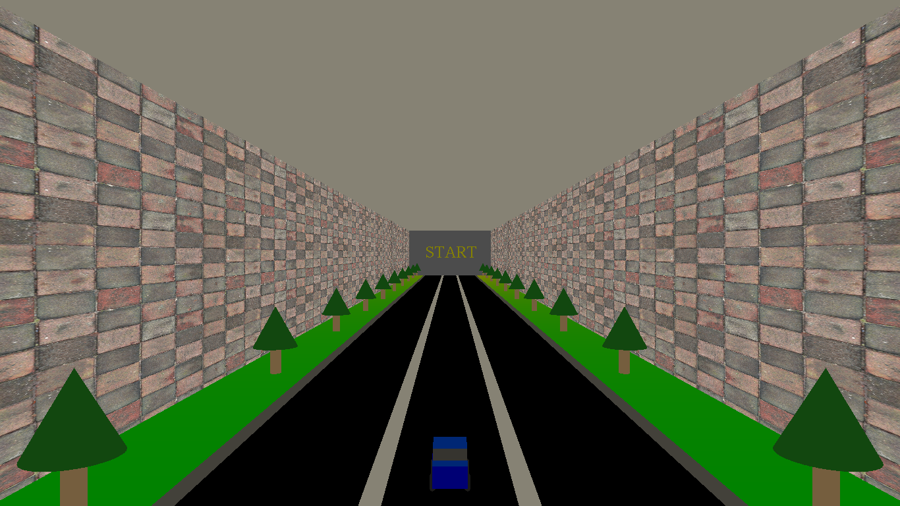
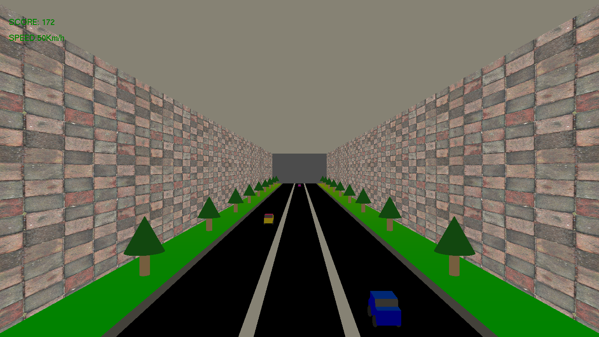
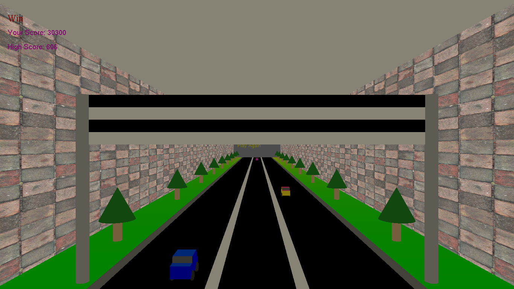

# Race Car Game
## Project: Game by C++ and OpenGl

### Install

This project requires **C++** and the following OpenGl libraries installed:

- [GL](https://www.opengl.org/)
- [Glu](https://www.opengl.org/)
- [Glut](https://www.opengl.org/)
- [Stb_image](https://www.opengl.org/)

You will also need to have software installed to run and execute an [visual studio](https://visualstudio.microsoft.com/)

### Code

Template code is provided in the `Race Game.sln` notebook file.

### How to play

Game provides playing with these kyes

- `W` or `w` incres speed and move fast.
- `S` or `s` decrese speed.
- `A` or `a` move left.
- `D` or `d` move right.

### Camera View

Game provides move tha camera with these kyes

- `↑` move up with camera.
- `↓` move down with camera.
- `←` move left with camera.
- `→` move right with camera.
- `I` or `i` zoom in.
- `O` or `o` zoom out.
- `R` or `r` reset the camera position.

###### this is the start shape before you play

###### you can press enter to start playing

###### if you crashed that mean game over and you can play again after press enter

###### there is a flag that is mean you win this round and you can play again after press enter

